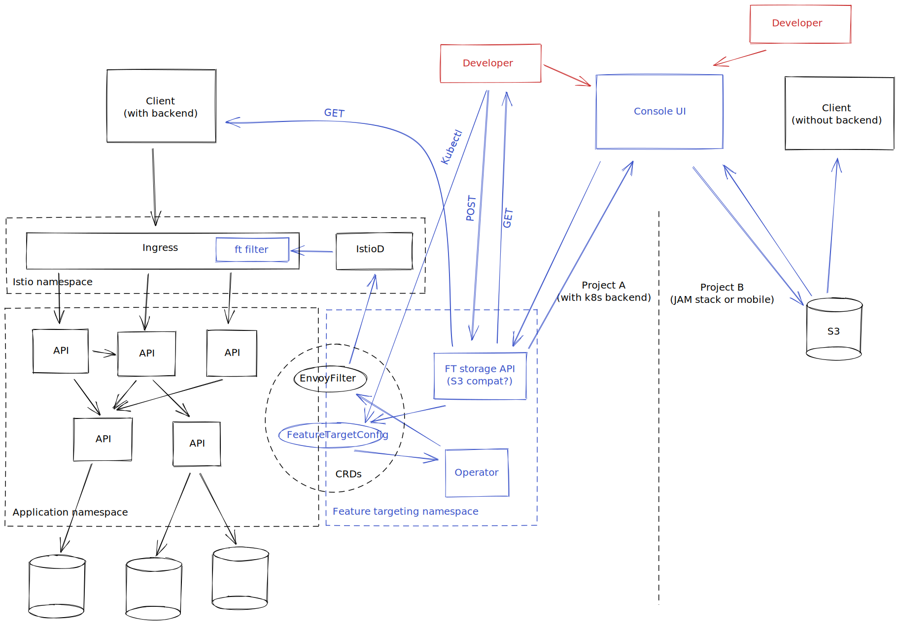

# Feature targeting

Infrastructure support to enable feature targeting in microservices based web
systems (and mobile apps).

This is currently highly experimental and production
use is not advisable unless you're brave.

## Getting started

See the [examples](./examples/README.md) directory to try things out.

## About feature targeting

Feature targeting is an evolution (or clarification) of the capability commonly
referred to as [feature toggles](https://www.martinfowler.com/articles/feature-toggles.html).

The term "feature toggle" is a little misleading. Partly in mentioning "features",
leading to an assumption that this capability is only useful for customer facing
product changes, but mostly due to the assumption that features can be on or
off for everyone and there is nothing in between.

_The incorrect assumption being made is that the entire audience sees the same product._

The key to feature targeting is allowing a feature (any behaviour of the system
which is either new or different from what the majority of users see) to be
enabled for a single user or any subset of users, selected according to
set criteria, or randomly (but in a "sticky" fashion).

This capability can then be used in place of a number of other commonly used
risk-reducing strategies for testing, deployment and release of software, e.g.
ephemeral and long-term environments, blue-green and canary deployments, etc.

The goal of feature targeting is to **fully separate deployments from releases**
and reduce complexity of IT infrastructure and automation, which is in place solely to
make sure customers don't see behaviours which are not ready for the public and
to reduce risk of issues caused by deployment.

### How it works

In order to target individual customers at any layer in the tech stack, the
expected state of each individual toggle needs to come from a single source
of truth, unique to that customer. In web based systems this is a HTTP request
(or more generally an RPC call).

A request header is therefore a good place to put the state of features. This can
be forwarded from service to service so that the feature state is the same through
the entire request tree serving a single customer request. In order to be safe,
the default state of a feature should be "disabled", only the features included
in the request are enabled.

An interesting benefit of having feature state on the HTTP request is the ability
to drive network infrastructure decisions (e.g. traffic routing) by the feature
flags as well, enabling "shadow deployment" of a new version of a service,
for example, routing traffic to it only if a particular feature is enabled.

### Implicit and Explicit targeting

There are two ways to enable a feature for a particular user: the system
targeting them **implicitly** based on rules, or the user requesting the feature
**explicitly** without any configuration being in place.

The latter is useful in a development team, when people need to enable a
particular feature for themselves for development and testing purposes, or when
sharing work in progress with an individual or a small group of people. There
are a few ways of achieving this, e.g. a hostname pattern such as
`feature-my-feature.example.com` (enables `my-feature`), a special HTTP header
with a list of features to enable, etc.

The former is useful when introducing the feature gradually to a larger group
of users outside the team without speaking to them first, but also for enabling
features for a specific supported location, type of customer, language variation,
etc. The targeting can be arbitrarily complex based on any piece of information
in the request.

### Change lifecycle

Each change set made by an engineer should begin by introducing a new feature
flag. In its simplest form this is a conditional statement checking the presence
of a particular feature name on the incoming request.

The engineer can then make changes, deploy them to a shared environment (even the live one)
and use explicit targeting to enable the feature for themselves, but nobody else.
This can be repeated as many times as necessary. An interesting side-effect is that
the incremental code changes made are immediately available to the wider team
(known as "mainline", or "trunk-based" development) reducing queuing of dependent changes.

Once the feature has been mostly completed, a QA person can use explicit targeting
to do deeper exploratory testing and outside-in regression tests can be written
exercising the feature, also using explicit targeting.

Finally, when the trust in the feature has grown to a point of being ready for
release, implicit targeting can be used to enable the feature for the whole team,
all of the staff, beta users, a percentage of the public or all of the public.

Once the feature is available for the full audience, the conditionals protecting
it can be removed, which concludes the life cycle.

Notice that this could be done without excessive codebase branching and a large
number of replicas of the live environment, but with the same level of safety.
This is the goal of this capability.

When this method is followed for all changes, deployments can be made automatically
for every change made, because by default, they have no user-facing effect. This
means changes are deployed more frequently and therefore are smaller in scope,
less risky and should they have negative impact, it is easier to diagnose and fix.
Feature targeting is a big enabler for continuous deployment to production.

### General architecture

In order to process incoming user requests and inject the enabled features
into them based on explicit and implicit targeting rules in a technology
agnostic way, the simplest way is to introduce an ingress proxy, which can
consult a targeting service before each user request.

The service uses the request and a set of rules as inputs to decide which features should be enabled
for this particular request. This is then returned to the proxy and injected
into the request before it is forwarded to the first service in the tree.

The services in the request path need to forward the enabled feature set to
their upstream services, so that the feature set is consistent throughout.

This architecture strongly resembles the architecture of API gateway based
systems and service meshes, so where possible, it is better from a complexity
and performance perspective to plug into that existing infrastructure.

### Supported platforms

Currently the only supported platform is [Kubernetes](https://kubernetes.io/)
with [Istio](https://istio.io/) service mesh. The long-term goal is to support most
common platforms and a "platform-less" use-case. The main difference between them
is the injection point, the targeting service is common.
